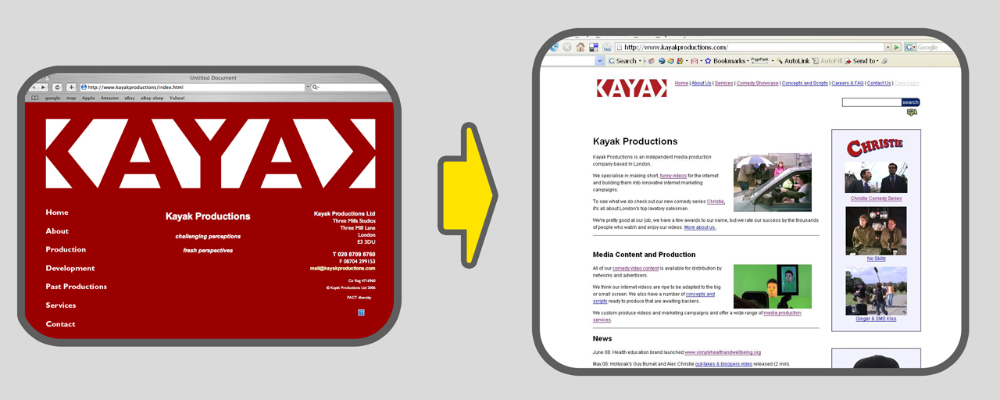

[http://www.kayakproductions.com](http://www.kayakproductions.com) web design. a) Before b) After

I web designed the <del><a href="http://www.kayakproductions.com">www.kayakproductions.com</a></del> (Update: this website from 2008 no longer exists.) website using Dreamweaver, Photoshop, HTML and CSS.

In the process I make it more user friendly and google friendly. As a result it shot up the Google rankings and received a boost in visitors.

The original site was in a strong red with an unusually large logo and a cryptic catchphrase. A new visitor to a site typically spends less than 10 seconds deciding whether to stay so it’s important to get the company identity across immediately. I did this by adding photographs and video, writing new copy for the main pages and giving the sections self explanatory titles.

I added search, a showcase, FAQ, careers, testimonials, and marketing tools like analytics, affiliate marketing, merchandise and calls to action.