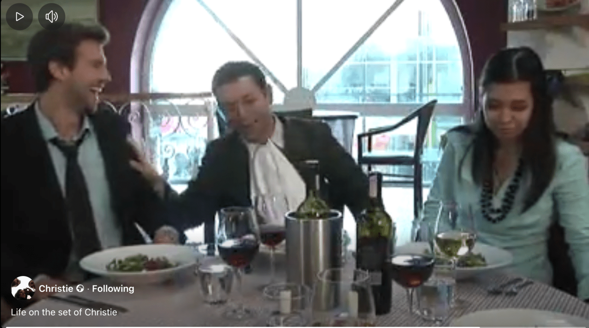

**Watch a [funny compilation of bloopers and outtakes from the Christie comedy series](https://www.facebook.com/100063522341477/videos/1024487405085) (2 mins).**

I co-edited this video alongside Alec Christie and I filmed the interview section.

On set Alec would often improvise funny lines to try to get Guy Burnet to laugh (Craig from Hollyoaks, and now a film star). The out-takes were so funny we put them into this compilation.

The interviewee in this clip is the actor Rufus Gerrard Wright best known from Extras, the Stephen Merchant radio show, and the London West-End Stage.

You can watch the Christie series on [YouTube](http://www.youtube.com/watch?v=IKJaoCMzAcc&feature=PlayList&p=8F5EC9D6A8848FD9&index=0&playnext=1), [facebook](http://www.facebook.com/pages/Christie/15991448677) and with additional features at [filmaka.com.](http://www.filmaka.com/filmaka_christie.php)