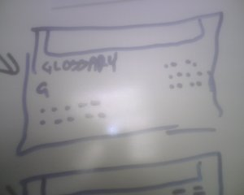

 

What’s the latest tool to hit web development?  Bluetac.  It might sound surprising but bluetac, scissors, post-it notes and a giant white board are the latest thing.  Cut-and-paste.  Literally.

Web development is expensive.  Bluetac and paper are cheap. It’s painful when you have to redesign a site because the customer has forgotten something.  Worse if it was your fault.  So why not make it easier for the both of you and do your re-designs on a giant white board.  It’s sure easier to sketch out a new page than write CSS.

I was working on a project that integrated a digital asset management system, a content management system and static web pages.  The complexity could be a real headache, a visual representation on a whiteboard is priceless.

At least, until someone invents the affordable, wall sized, touch sensitive screen.