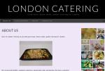

[www.londoncatering.org.uk](https://web.archive.org/web/20141021131500/http://www.londoncatering.org.uk/) accessed 2014

Working for a charity in north London I made a website for their catering service.  I used the technology WordPress to build the site so that the community group could easily log in and update the site.

I attended meetings with the community group to get ideas for the website and work in a collaborative way.  Afterwards I ran workshops in the use of WordPress so that the group would be able to updated the site.  The only complicated part of the site is a little bit of custom CSS code I added to make the fonts bigger.

**Update 2025:** The website was used for a number of years before the charity stopped updating it. An archived version of the website from 2014 is at:  
[https://web.archive.org/web/20141021131500/http://www.londoncatering.org.uk/www.londoncatering.org.uk](https://web.archive.org/web/20141021131500/http://www.londoncatering.org.uk/)