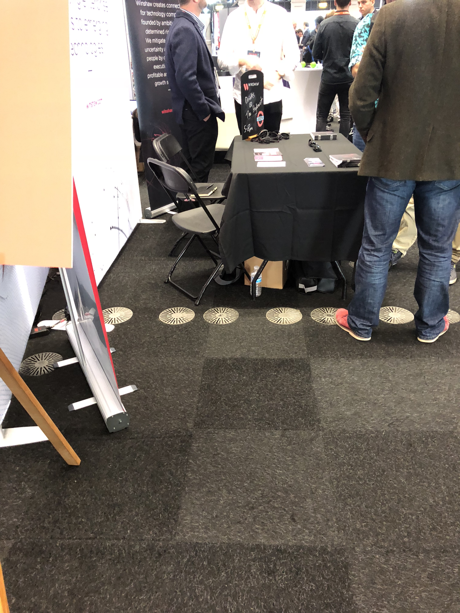
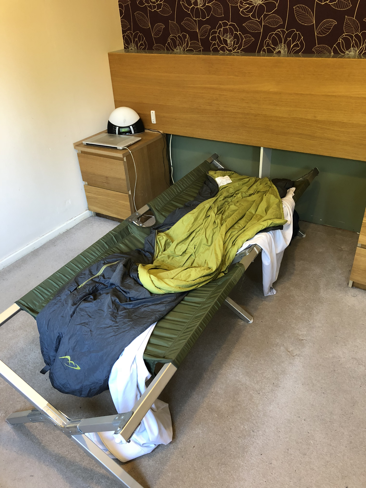
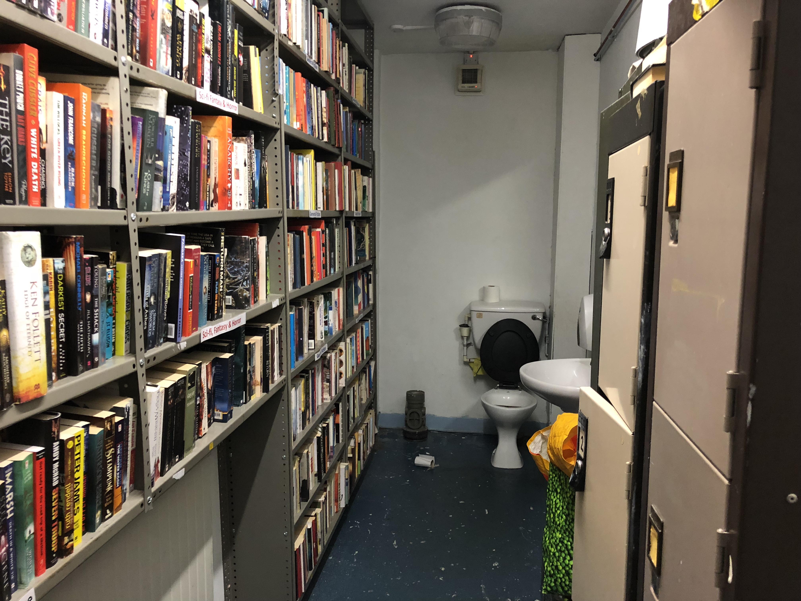
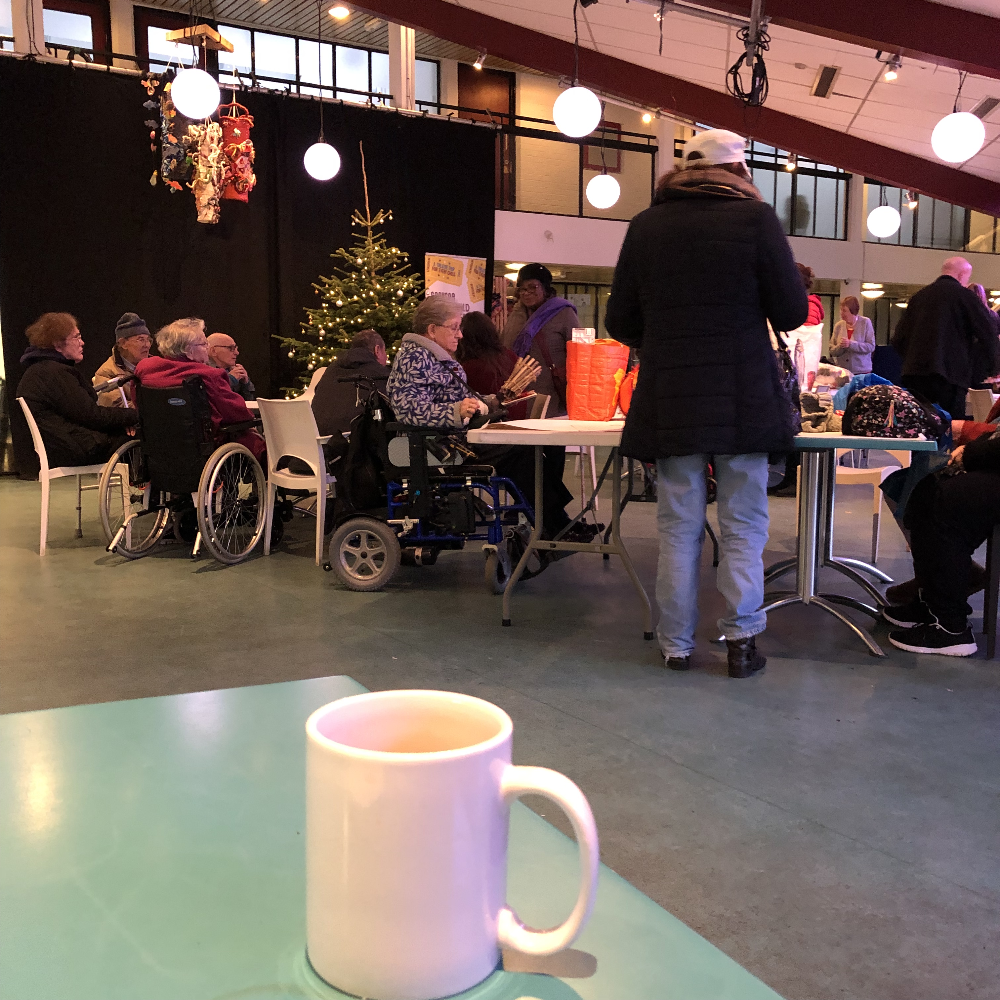

After buying my first flat, (a London flat is like a US apartment, but smaller, and more expensive) and frantically developing websites and apps for a failing (now failed) technology start-up company, I was made redundant.

I suddenly had some free time to work on my own software project, buy some furniture, blog, and stop living like some cross between Mark Zuckerberg and [Renton from Trainspotting](https://www.imdb.com/title/tt0117951/mediaviewer/rm3666984448).

Goals of the project:

1.  Showcase my technical skills to future employers
2.  Learn new technology
3.  Make some software that I’m going to enjoy building
4.  Build a website and app using the same codebase
5.  \[optional\] Make something people want, and will pay for

I spent ages trying to think of a thing that people want. Most of my ideas had already been done e.g. [The Great British Toilet Map](https://www.toiletmap.org.uk/). After a lot of research into start-ups over the years including recently seeing serial tech investor Andrew Lockley, tearing apart business ideas in a Dragon’s Den (or Shark Tank) style at the ‘London Tech Day’ and reading Lockley’s blog post ‘[top 10 reasons why your business plan is pants](https://andrewlockley.com/investments/top-10-reasons-why-your-business-plan-is-pants)‘ I came to the conclusion that, at least for now, I’m better off making a personal portfolio project that will be enjoyable to make, rather than trying to create a profitable product.

However, I took away one bit of advice from Lockley: you need to know your domain. Your domain is your specialist subject, the area of knowledge where you have a competitive advantage, and aren’t just winging it on optimism bias and wishful thinking.

London Tech Day: Hopeful start-ups vying for each other’s (not customers’) attention.

What do I know about?…

I’m an [Underground Comedian](https://comedy.louiechristie.com/). But new act stand-up comedy nights have already been covered by various websites, including [Open Comedy](https://www.facebook.com/groups/53978194847/permalink/10158529103169848?sfns=mo).

I’ve just finished working on a car app. Vehicle telematics? Loads of companies are doing it, and I live in London – I can’t remember the last time I needed to drive a car anywhere. I’m green, I don’t even like cars.

So what is my domain?

In my free time I’ve been wondering around my local area. I only moved to the New Cross and Deptford area of South London in the summer, but I was so busy at work, I hadn’t furnished my flat or explored the area. Finally I had time to do both those things.

As I wondered around, I was looking for website or app ideas. Maybe things in the world that people were doing manually, or on paper, that could be digitised. Maybe needs that aren’t getting addressed.

I’d also been so busy at work and moving house I’d neglected to exercise, so I took up jogging.

On one of my jogs I discovered an old mattress that had been fly-tipped and dumped on the pavement. I joked to my girlfriend that I’d bring it home for us to sleep on.

Then I kept on discovering fly-tipping, particularly mattresses and beds. I did some research and discovered the excellent [FixMyStreet.com](https://www.fixmystreet.com/). And it became a new hobby of sorts, to [report dumped mattresses and beds](http://lovelewisham.com/Home/Details/7a5018c4-b049-4141-876b-f443dec9e3e6) from my daily walks and jogs. Then the council would be alerted by the app, and the fly-tipped mattress, probably soggy now, would be collected, and sent for recycling.

(Ironically all this rigmoral is pointless because [Lewisham council offer a free mattress collection service](https://lewisham.gov.uk/myservices/wasterecycle/dispose-of/book-a-free-mattress-collection-now), but no one seems to have told the punters round my way.)

I took one of the dumped bed frames home, and it became my bed. (But don’t tell my girlfriend.)

I didn’t however, take home one of the old mattresses. I drew a line at that. As my girlfriend’s old Irish grandmother’s says:

> “Buy a decent pair of shoes and a decent mattress. Because you are always in one or the other.”
> 
> <cite><em>– Old Irish grandmother’s saying</em></cite>

So I bought the [Which? magazine best buy online ‘bed-in-a-box’ mattress](https://www.which.co.uk/reviews/mattresses/article/top-bed-in-a-box-mattresses).

I’d been so busy at work, I’d been sleeping on a camp bed for a month, and then the Which? Best Buy mattress on the floor for months.

My new girlfriend had been very understanding about sleeping on the floor. She, as a jobbing actor, was sub-letting a late night roulette TV presenter friend’s flat. My girlfriend was sub-letting between herself doing stints in Ireland acting in an arty film where she played the part of a talking cupboard – so she was used to roughing it a bit.

(Which was not the attitude I was expecting from having watched women in ‘Sex And The City’ and, that winter, reading the Tinder profiles of the duck-faced Instagram generation.)

I also noticed [The Great British Toilet Map](https://www.toiletmap.org.uk/) and [FixMyStreet.com](https://www.fixmystreet.com/) were not using the Google Maps I was used to. This led to geeking out on [OpenStreetMap](https://www.openstreetmap.org/) and attending their [London meet-ups](https://www.eventbrite.co.uk/e/missing-maps-march-mapathon-tickets-56096635547?ref=eios).

Anyway, I was also scouting out local places where I can work from, the local libraries, cafes, co-working spaces and hipster hang-outs. Of which there are many; New Cross and Deptford are up-and-coming areas with a local art-student scene from Goldsmiths University.

<iframe title="VideoPress Video Player" aria-label="VideoPress Video Player" width="500" height="281" src="https://video.wordpress.com/embed/xROIzdpM?cover=1&amp;preloadContent=metadata&amp;hd=0" frameborder="0" allowfullscreen="" data-resize-to-parent="true" allow="clipboard-write"></iframe>

Please world, don’t make me go back to a grey office.

So I was racking my brain, what’s my domain? What is my specialist subject?

I could just get data from an open API (app programmer’s interface – for getting data from a cloud on the Internet), such as the Internet Movie Database API. Apparently it’s the most used open API. But that’s a bit boring and over used. But if I don’t use an open API, where am I going to get data from?

I can’t expect to use user-generated content at first, because I don’t have any users ([see Lockley’s rule #2](https://andrewlockley.com/investments/top-10-reasons-why-your-business-plan-is-pants)), also my previous experience of user generated content on a now defunct website I worked on idiotsguides.com, is you get a load of spam, flame wars, and all that nonsense.

What do I know about, that I’ll enjoy building?

I’d almost taken part in the Goldsmiths University weekend long Hackathon.

> **Hackathon**: portmanteau[\[1\]](#footnotes) of ‘hack’ and ‘marathon’. However, confusingly, it has nothing to do with breaking into computers, or running 27 miles, and is more like an adult sleepover where you eat pizza, make websites, and throw sleep-deprived huffs at strangers.

The theme was ‘Herritage Hack’. But it wasn’t clear whether non-students were allowed to take part. So I read the [background materials](http://goldsmiths.tech/heritage) on the theme, and decided to go to the presentations at the end of the weekend, to see what the students had created.

On the Saturday I got an e-mail thanking the entrants for taking part and asking for feedback. ‘Bit weird,’ I thought, ‘maybe they finished early?’.

I went to the presentations on the Sunday and true enough, myself and a woman from the local ‘Brockley Society’ found the university hackathon room empty and no presentations to be had. ‘Bloody students’ I joked in my head. They are not the most reliable bunch. I was the same when I was at university.

But one of the suggested projects for the Hackathon interested me. The Lewisham Museum, an odd collection of things, currently locked away in the basement of the New Cross volunteer run library, ‘New Cross Learning’.

I’d already been to New Cross Learning while exploring.

The funnest thing about it is the downstairs toilet has bookshelves in it. The crime section I seem to remember.

The Lewisham museum collection of oddities is not open to the public. The Lewisham Museum is unlikely to ever have a physical space open to the public. Perhaps I could do a museum website / app instead.

I’d already been to the South London Horniman Museum looking for the shrunken heads and the [merman](https://img.horniman.ac.uk/deepzoom-mob.php?dzi=167/714/NH_82_5_223__001_DS.ptif). Sadly the heads weren’t on display (the Spanish volunteer gave me a weird look when I asked her about them) and the [merman](https://img.horniman.ac.uk/deepzoom-mob.php?dzi=167/714/NH_82_5_223__001_DS.ptif) is on loan/holiday in New York. But I did discover that the British EU passport is now a museum piece.

###### [@todo fix this Instagram embed](https://github.com/11ty/eleventy-import/issues/20)

> [
> 
> View this post on Instagram
> 
> ](https://www.instagram.com/p/BqU5Xenhdyi/?utm_source=ig_embed&utm_campaign=loading)

So while wondering New Cross and Deptford looking for ideas and exploring interesting places, the idea hit me…

I was probably at the Albany Theatre at the time. It was my new favourite mid-week lunch spot. There is normally some community event going on in the cafe: old people knitting, breaking into song, unemployed people working on their CVs, that sort of wholesome thing that gets you out of your geeky head for a while and gives you a warm feeling of being connected to the community and there being good in the world.

The antidote to the hard-nosed business world where you work for a boss for four years and one day he pretty much tells you to return you security pass, collect your stuff in a cardboard box, and never return to the building.

Plus there’s not many places in London where a quality home cooked meal (including some ingredients home-grown in their garden) can be bought for only about a fiver (£5.)

The idea that hit me was… my specialist subject, my domain, is this:

> **The weird, funny, and hipster things to do around New Cross and Deptford.**

I’d spent the last few weeks scouting out all these things in the area. I know where all the community toilets are thanks to the [Great British Toilet Map](https://www.toiletmap.org.uk/). Why not build an app / website of all the weird, funny, and hipster things to do around New Cross and Deptford I’ve discovered? If I have time, I could also add a section for the Lewisham Museum.

The idea is map based, which I like, and gives me an excuse to use [OpenStreetMap](https://www.openstreetmap.org/). Also, one of the companies I was courting to work for, uses MapBox so potentially I could learn that as part of the project.

Actually there is one very good reason not to do the project. It’s very niche, it’s not something that people will want in great numbers and it is unlikely people will want to pay for it. It’s not really an idea that scales, unless, maybe I make it a technology platform and do something like sell fanchises to people in other geographical areas. And the local geeks, students, and hipsters are unlikely to pay for it.

But you know what. F@CK IT.

I’d enjoy making the project, I know the domain and the technology, and it will showcase my skills if nothing else. It could meet goals 1-4 just not goal 5. (At the [beginning of this blog post](https://blog.louiechristie.com/2018/11/30/choosing-a-software-project/), remember the goals?)

As someone once said: ‘screw it, lets do it.’

(I forget who said it. Sounds like a self-help book title.)

And the name for the project came quite quickly, a quick search showed it was available.[\[2\]](#Footnotes)

A portmanteau[\[1\]](#footnotes) of New Cross and curiousities. (Actually, it started as Newcrossity, but my girlfriend thought the plural works better, and she has an English degree waiting to be used. And it now reminds me of the Geocities website from the nineties, popular before the first dot com crash.)

It’s not perfect, ideally I’d like it to be something with no ambiguity in the spelling of the name – is it one s or two? But it’s better than one company I worked for, that went from one regularly mis-pronounced name, to another, regularly mis-pronounced name. The CEO had previously announced something like “we don’t know what the new name will be yet, we have a crack team of expensive marketing consultants working on it, but one thing I promise, it will be easy to pronounce.” It wasn’t.

Newcrossities will do, and I’ve learned from comedy improv: don’t spend more time, blood, sweat and tears on coming up with a team name than doing the actual acting. [Naming things may be the #2 hardest thing in computer science](https://www.martinfowler.com/bliki/TwoHardThings.html), but you can change names of things later if you have to, it’s a ball ache, but you can. [(Like Stripe.com did.)](https://tim.blog/2018/12/20/patrick-collison/)

Maybe I’ll talk to a marketing friend later about the name, and before marketing it. Or maybe I won’t market it at all. (Like [young billionaire Stripe.com CEO Patrick Collison](https://twitter.com/louiechristie/status/1092154154368319488?s=21) didn’t do at first.)

Goals 1-4, Louie, goals 1-4. Stop writing this blog post and actually make the software.

**UPDATE March 2020: I made it, she lives! 🎉 Beta version of Newcrossities is live at:**

**[https://www.newcrossities.com/](https://www.newcrossities.com/)**

I’ll be giving tech talks about the project, I have a couple in my diary soon that have been cancelled due to coronavirus COVID-19.

And to my detractors I would say… It takes a lot of time to make something look this slapdash.

* * *

#### Footnotes

\[1\] portmanteau: \[noun\] A new word that has been invented by blending together two perfectly good words. A trend made popular since Brexit. A trend I perpetuate which is deeply annoying to my girlfriend.

\[2\] I’m a bit weary of working on projects that no-one thought to check if the name is already in common usage by someone else. (And already Google SEO search engine optimised by someone else.) Normally ‘Portal’ or ‘UMS – universal management platform’ or iSomething. Or (in a trend originally pointed out to me by comedian [Boris Witzenfeld](https://www.comedycv.co.uk/boriswitzenfeld/index.html) ) Adjective Animal, e.g. Hungry Horse, Fast Skunk, Punchy Monkey – because the company thinks it’s quirky and original… just like everybody else.

#### Acknowledgements

Cover photo: A Goldsmiths art student I stumbled across at New Cross Learning (library), does an [art project](https://www.instagram.com/themilkhasturned/) based on maps of the New Cross / Deptford area. Probably a lot better than my geeky attempt will be.