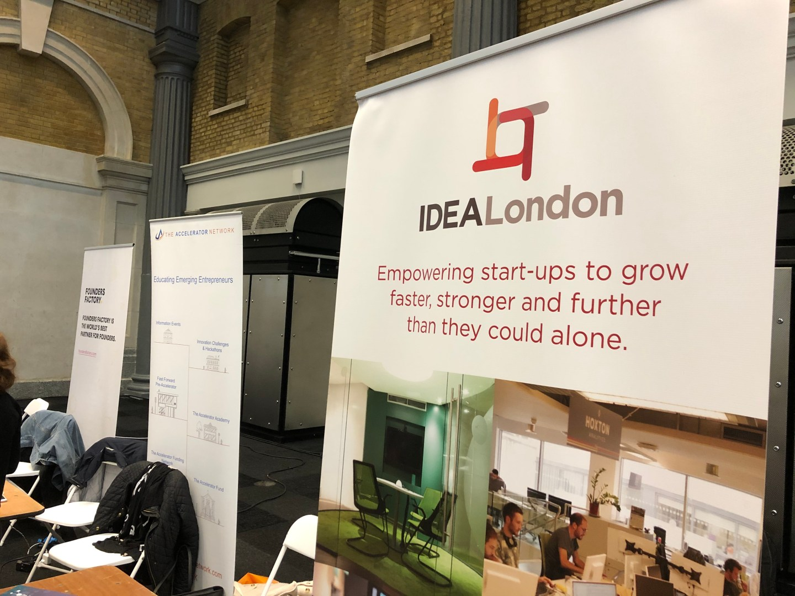
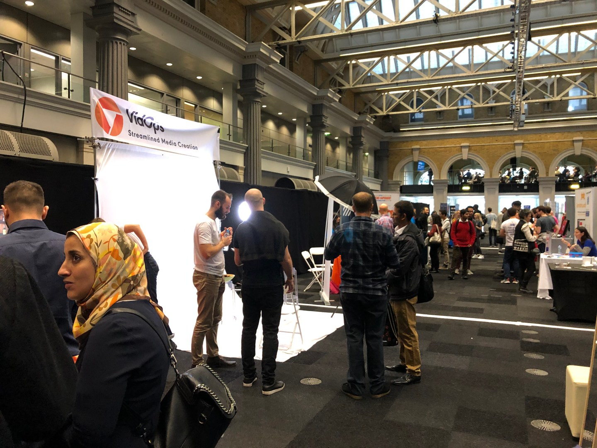

London Tech Day is like London Tech Week, but shorter. Despite this it’s a pretty good day out.

Billed as a day for start-up companies, the day to me represents everything that’s good and bad about the technology start-ups scene.

A guy in a suit stood on stage and told us about his new company that uses electrical simulation to treat pain, and is controlled through an app. ‘Sounds like a good idea’, I thought, ‘like a better TENS machine with an app?’.

> About 50 per cent of people with long-term pain find Transcutaneous Electrical Nerve Stimulators, or “TENS”, machines helpful. They are small devices which deliver electrical signals through the skin, which compete with pain sensations.
> 
> <cite>– excerpt from booklet [advert] <a href="https://amzn.to/2NjDKzW">Simply Pain: An Informative Look At The Difficult Subject Of Long-Term Pain on Amazon.com</a> [end of advert]</cite>

The guy went on to say the technology is being used already by NASA because they have limited medical supplies in space, ‘that makes sense, tell me more’ I thought. The guy told us that it uses quantum physics and using the app you can treat someone else, anywhere in the world.

‘Wait,’ I flinched ‘did he just say you can treat anyone in the world? Not remotely? Did I misunderstand that? Or is he a nutter?’

He said he doesn’t understand the science bit, that’s not his science, and can’t talk about it because of intellectual property, but they are aiming for 1% of a 1 billion market in the first year (think it was UK healthcare spend), and then 1% of some other £300 billion market (global healthcare spend?) in the third year. \[Note: Most start-ups lose money in the first few years. Most start-ups ultimately fail.\] I did the maths that’s 10 million in the first year and 3 billion in the third year.

‘He _is_ a nutter’ I thought.

And I understood why the investors on Dragon’s Den (or USA Shark Tank) always look like they’re chewing a wasp.

At some point he said all he needed was to recruit some software developers ([see Tom Segura on his cousin the inventor](https://www.youtube.com/watch?v=pT6Dqc5OVJU)) and he’s looking for investment of 1 million to fund research and development. He’ll get scientific proof it works later, the important thing now is to make a world-class app.

Then he told some rousing story about treating his sick daughter by, now I think about it, electrocuting her.

I had lunch with a social media sports influencer, who’s been in it ‘for a while’, he said, because he’s been going a couple of months. He’s here to learn new technology he can use. When he broke into his third bout of unexpected, uncontrollable laughter I took a gamble and told him he reminded me of the character in the film ‘Joker’. He ‘liked that’ he said, the ‘best thing I’d said all lunch’. ‘You need a sense of humour’ in the tech industry he said. He’s not wrong.

I assumed he was another nutter. Later I Googled him and he’s a former England cricketer, who also broke his ankle on TV’s Dancing On Ice. ‘There’s something loveable about spin bowlers’ my sports-fan housemate later told me, ‘when they get someone out you feel the batter has been hoodwinked.’ So I guess the joke’s on me. I _feel_ like I was hoodwinked. As a guy who’s more into computers and surfing than team sports, I was completely oblivious. [But on the other hand…](https://twitter.com/1tip1hand/status/1188197357902536704?s=20)

And that’s the thing about the tech startup world and entrepreneurs – it’s hard to spot the nutters from the geniuses. They behave kind-of similar. Einstein had crazy hair and Steve Jobs wore turtlenecks.

(And turtlenecks way into the 2010’s after they had gone out of fashion and been given up by stage magician David Copperfield, and the Milk Tray Man.)

Sometimes I wonder if the only difference between a tech genius and a tech madman is luck.

I had a previous boss who I used to say I wasn’t sure if he was a genius or a madman. His tech start-up company ended up going into liquidation owing nearly a million pounds. Genius or madman? I’m still not sure.

I watched the documentary on Netflix about the disastrous Fyre App Festival and someone said the same thing about their old boss: they weren’t sure if he was a genius or a madman. ‘What do you think now?’ asked the interviewer. The former employee replied: ‘I think he’s a liar’.

\[advert\] flexoffers [documentary on Netflix about the disastrous Fyre Festival](https://www.netflix.com/gb/title/81035279) \[end of advert\]

You get conmen too. In an industry full of hype, with billions to win, and with investors with loose wallets and millions of pounds to dish out (or burn, they even nickname start-ups spending as ‘burn rate’), many cross the line from truth, to hype, to lies.

The worst is when they actually believe their own bullshit.

Declare themselves the first and/or leading company in their field without even a cursory five minute Google to see that they have competitors.

Or you can’t guess what they actually do because they sell ’empowerment’.

Or they resell office space as ‘[elevating the world’s consciousness](https://www.sec.gov/Archives/edgar/data/1533523/000119312519220499/d781982ds1.htm#toc781982_1)‘, or sell filing as ‘[unleashing the world’s creative energy](https://news.ycombinator.com/item?id=19971866)‘.

There were good companies at London Tech Day too.

I bumped into an associate who I’d met at a few events who runs a perfectly respectable, if a little unsexy, IT consultancy business. ‘You never know where your next customer will come from’, he said. ‘We offer start-ups a cheap, two-day consultancy service, in-and-out. The hope is, then when they become successful, big companies with the cash to go with it, they remember us and pay for the full service.’ I can’t argue with that.

I also met a company offering a team in Poland to build your app, Poland being the sweet spot, perhaps, the only Brit on the stand said, between a country with cheap workers due to the weak currency, but with tech workers with good communication skills and near perfect English.

I’ve met some excellent Polish software developers at the React Native conference so I’d have to agree. I’ve also met inpatient ones with no social skills, but I suppose that’s computer geeks in general (myself included.) I reckon it would make sense to come to an event like this and meet the team first, before hiring them.

Upstairs there was the tech day talks room, that you can easily blag your way into without paying the extra £170, using your regular free/£20 ticket by dodging the guard on the stairs, using a press pass, or by walking past the guard smiling.

It was supposed to have talks. Occasionally, randomly someone would give a presentation, but the only staff member, a bedraggled person working the AV desk, when asked, was as oblivious as anyone about the agenda, almost as badly informed as the downloadable event app. For the most part the room was near empty. Apparently there was a separate VIP entrance and VIP lounge, but I never found it. I hope this room wasn’t it.

I met many companies, the ordinary, the interesting, the weird, got a load of free [tat](https://themuseumoftat.blogspot.com/2014/08/what-is-tat.html?fbclid=IwAR0WU6wGukuXBQFuzhAtd1cKn0NYkZBupwMookowgcNxnhaR3iPFUqn0eF4), pens, tote bags, and a free photography studio session.

Which was handy, because I need a new photo head-shot for a website. Not wanting to pay for a professional photographer shoot, I couldn’t argue with the cost today of absolutely free.

While a bit lacking this year, last year I found some really innovative and useful companies at London Tech Day.

A company, set up by some Imperial College London university students, that used a new material, what looked like metal grills, to extract water out of air in the desert, like in the Frank Herbert’s sci-fi [Dune](https://epicport.com/en/dune2).

(Update: At time of writing 28/10/2019 their website is down. Have they gone bankrupt in one year? I don’t know? I hope not, but I wouldn’t be surprised, as is the way with tech start-ups.)

And my favourite was [a Japanese company that used ultrasound to detect when an old person is about to wet themselves](https://www.dfreeus.biz/). It fires a warning notification to the app of a carer from the device from a device on a belt strapped above the would be bed-wetter’s bladder. Then they can be rushed to the loo, saving the carer the hassle of changing sheets, and saving the planet from another hot-wash.

Useful, hi-tech, yet ordinary, and moneysaving. My tip for the top. And as someone with a weak bladder who likes craft beer, I could do with one of those myself.

So London Tech day represents to me, everything that is right and wrong about the London tech start-up scene.

Exciting, bat-shit crazy, fuelled by hype, free stuff to be had, a whiff of cash, with some decent gems of people doing great work in-there somewhere bringing the future, while most fail, an utterly glorious shitshow.