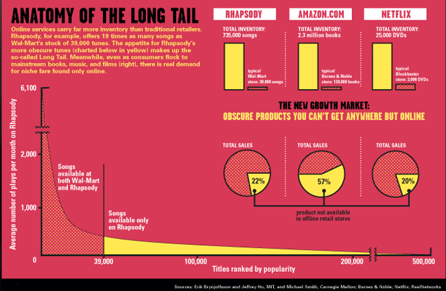

I just spent an afternoon digital gardening my blog.

Things like:

1.  Fixing old broken links
2.  Moving videos from old broken social media platforms (e.g. MySpace) to new platforms that can still be watched (e.g. Vimeo)
3.  Updating with new information that has come to light – like that Guy Burnett who [was in short films I worked on](https://louiechristie.wordpress.com/2008/07/08/christie-bloopers-outtakes/), is now a movie star
4.  Removing defunct technology and moving over to other tech

I did a similar thing coaching my friend who’d taken over the charity SuperKidz Trust. ‘It’s like gardening!’ he’d said as we slowly modernised and updated the website \[[before](https://web.archive.org/web/20240921211039/https://www.superkidztrust.org/)\] \[[after](https://web.archive.org/web/20250329114914/https://www.superkidztrust.org/)\].

I didn’t invent the term ‘digital gardening’. I think a few people have independently come to the analogy, like my friend did. I first heard the term from [Maggie Appleton, and she talks more about it on her Digital Garden.](https://maggieappleton.com/garden-history)

Big bang website relaunches are rarely a good idea, better to garden and weed. The mistake most companies make is they think the budget goes on launching a website, but maintaining it is where the money and effort needs to go.

Instead of budgeting for a new website, budget a yearly amount to maintain and update your website – your gardening budget. Because a flashy website with broken links and outdated content isn’t worth much – to users _or_ search engine rankings.

[Cool URLs don’t change](https://www.w3.org/Provider/Style/URI), because you don’t want to miss out on the [Long Tail](https://archive.is/v5WuB) of niche customers over the years and decades.

## On Fixing Broken Web Links

Old links shouldn’t break folks.

Technical hint: if you need to move content, use 302 redirects please.

But not 301 redirects, because we did those once, and weirdly they can _[never be undone](https://jacquesmattheij.com/301-redirects-a-dangerous-one-way-street/)_ (and maybe the old links got published in a book 😬.)

[Cache invalidation is the #1 hardest thing](https://www.martinfowler.com/bliki/TwoHardThings.html) in computer science 😉.