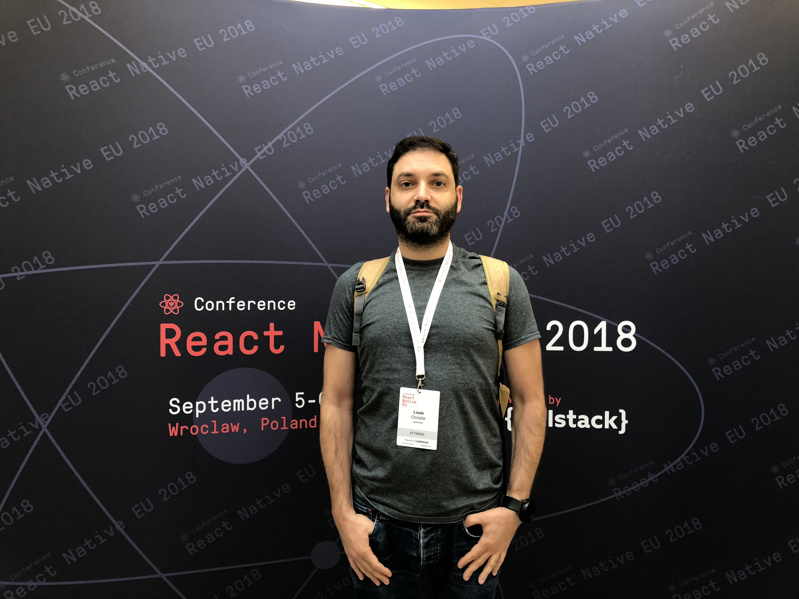

Hello ! 👋

My name is Louie Christie and I live in London.

This is a blog about my creative technology projects and associated rantings.

I’m a freelance app & website developer, tech geek for hire, coding coach, and underground comedian in my own head.

This blog was created around 2008, when I was a young, enthusiastic, gloriously naive graduate spending my time travelling, studying, and making creative projects in technology and media.

At that time I made this blog to document some of that heady period.

Then I ran out of money, got jobs, signed non-disclosure agreements, and this blog dried up.

Ten years later in 2018, I was [made redundant](/blog/2018/11/30/choosing-a-software-project/) from one of the more than 90%[\*](http://innovationfootprints.com/wp-content/uploads/2015/07/startup-genome-report-extra-on-premature-scaling.pdf) of technology start-up companies that fail, and took the opportunity to blog, be free, freelance, and creative again.

I’m smart, talented, modest, and available for hire.

Feel free to [get in touch](https://www.louiechristie.com/contact/) if you like what you see.

**[More about me…](https://www.louiechristie.com/about/)**
